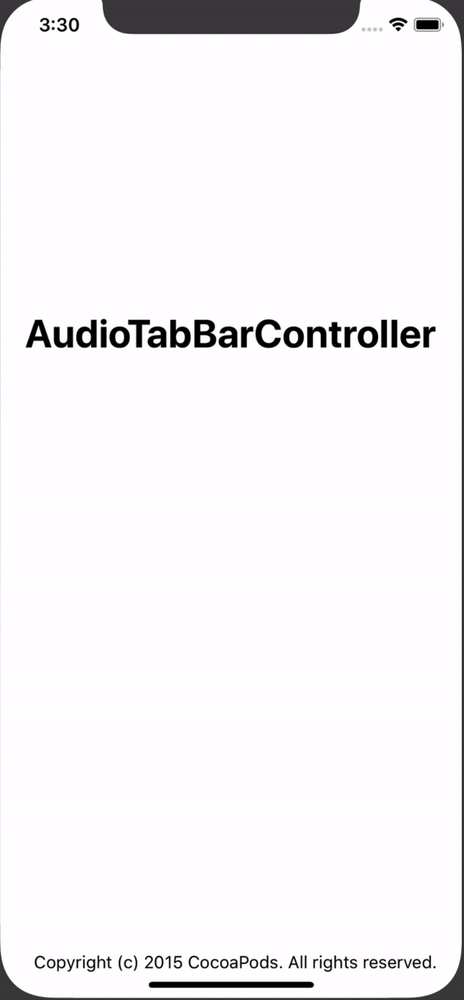

# AudioTabBarController

AudioTabBarController is a custom tab bar controller to mimick playback view like on apple music or spotify.

AudioTabBarController will show playback audio on the bottom tab bar, and can be shared among view controllers. It's also using UITabBar to keep using native iOS framework instead of UIButton and UIView, so you can assign the tab bar item directly from your UIViewController's tabBarItem property, reducing boilerplate code and easier migration process from native UITabBarController to AudioTabBarController.

## Example

To run the example project, clone the repo, and run `pod install` from the Example directory first.

## Screenshot


## Requirements

AudioTabBarController is compatible with iOS 9.0 and Swift 4. Also, it's compatible with iPhone X.

## Installation

AudioTabBarController is available through [CocoaPods](https://cocoapods.org). To install
it, simply add the following line to your Podfile:

```ruby
pod 'AudioTabBarController'
```

## TODO
Several task todo on AudioTabBarController :
- [ ] Adding delegate for AudioTabBarController to similiar with UITabBarController.
- [ ] Adding delegate for UITabBar inside the AudioTabBarController.
- [ ] Customizeable tab bar items.


## Author

Hendy Christianto, hendychrst90@gmail.com

## License

AudioTabBarController is available under the MIT license.

Copyright (c) 2018 Hendy Christianto <hendychrst90@gmail.com>

Permission is hereby granted, free of charge, to any person obtaining a copy
of this software and associated documentation files (the "Software"), to deal
in the Software without restriction, including without limitation the rights
to use, copy, modify, merge, publish, distribute, sublicense, and/or sell
copies of the Software, and to permit persons to whom the Software is
furnished to do so, subject to the following conditions:

The above copyright notice and this permission notice shall be included in
all copies or substantial portions of the Software.

THE SOFTWARE IS PROVIDED "AS IS", WITHOUT WARRANTY OF ANY KIND, EXPRESS OR
IMPLIED, INCLUDING BUT NOT LIMITED TO THE WARRANTIES OF MERCHANTABILITY,
FITNESS FOR A PARTICULAR PURPOSE AND NONINFRINGEMENT. IN NO EVENT SHALL THE
AUTHORS OR COPYRIGHT HOLDERS BE LIABLE FOR ANY CLAIM, DAMAGES OR OTHER
LIABILITY, WHETHER IN AN ACTION OF CONTRACT, TORT OR OTHERWISE, ARISING FROM,
OUT OF OR IN CONNECTION WITH THE SOFTWARE OR THE USE OR OTHER DEALINGS IN
THE SOFTWARE.

